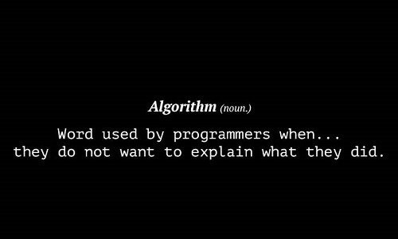
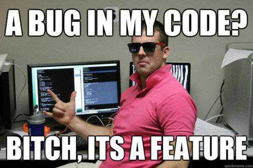

<!--
**HarshPanchal18/HarshPanchal18** is a ✨ _special_ ✨ repository because its `README.md` (this file) appears on your GitHub profile.

Here are some ideas to get you started:

- 🔭 I’m currently working on ...
- 🌱 I’m currently learning ...
- 👯 I’m looking to collaborate on ...
- 🤔 I’m looking for help with ...
- 💬 Ask me about ...
- 📫 How to reach me: ...
- 😄 Pronouns: ...
- ⚡ Fun fact: ...
-->
<div align="center">
	
	<p>One moment please...</p>
</div>

</p>

```
▄▄    ▄▄                                ▄▄       
██    ██                                ██       
██    ██   ▄█████▄   ██▄████  ▄▄█████▄  ██▄████▄ 
████████   ▀ ▄▄▄██   ██▀      ██▄▄▄▄ ▀  ██▀   ██ 
██    ██  ▄██▀▀▀██   ██        ▀▀▀▀██▄  ██    ██ 
██    ██  ██▄▄▄███   ██       █▄▄▄▄▄██  ██    ██ 
▀▀    ▀▀   ▀▀▀▀ ▀▀   ▀▀        ▀▀▀▀▀▀   ▀▀    ▀▀                                               
```

[](https://www.latimes.com/business/technology/story/2020-06-12/github-ceo-black-lives-matter-employees-demand-end-ice-contract)


## 🕵 Who Am I

```bash
$ whoami
  
> Student passionate about Computer Science and mathematical / scientific subjects 
  with an irrepressible desire to learn new things. 
```
<details>
	<summary>MEMER</summary>
	
	
	
</details>

<a href="https://app.daily.dev/harshpanchal"></a>

<!--<a href="https://github.com/kittinan/spotify-github-profile" target="blank">
  
</a>-->


---

[](https://github.com/kittinan/spotify-github-profile)

### Hi all 👋🏼
I'm trying to express who I am as a someone who writes software in the below.
> you can expect the content to be changed any time


I:

- **code** to express what should be done and how, for both humans and machines

- **document** things that should be shared within and across teams for everyone's mental health

- **write tests** to avoid doing same tests manually again for my future self and others (usually the future comes very quickly)

- **read** to understand why and how things are this way rather than other ways

- **play and learn** or learn and play for joy and new possibilities

- **step away** to be able to see things clearer (in different distances and angles)

- **measure** so I can see what changes are needed and how much the changes actually impacted

- **listen to** patterns especially more repeating ones to see what's going on and what to do about it

- **participate** to build a better community

- **admire** great works from who were before us

- **appreciate** what you've done for us

- **admit** current limits and weaknesses of mine

- **challenge** to explore further than current limits

- **improve** environments for better opportunities and safeties

- **build** stuff mostly to build better tools...

- **spend** time and energy for reducing repetition to save time and energy

- **fight** with perfectionism to pay attention to priorities

- **(should) beg forgiveness** whenever it's necessary

- **embrace** undesirable outcomes as a natural companion that will bring possibly better methods and outcomes

- **suffer** or at least suffered from probably whatever you went through as a normal human being

- **like** to keep pushing forward and understand occasional break times are necessary for that

- **find** it hard to finish this list naturally so I will just suddenly stop here 🤪

<!--
**ryuheechul/ryuheechul** is a ✨ _special_ ✨ repository because its `README.md` (this file) appears on your GitHub profile.

Here are some ideas to get you started:

- 🔭 I’m currently working on ...
- 🌱 I’m currently learning ...
- 👯 I’m looking to collaborate on ...
- 🤔 I’m looking for help with ...
- 💬 Ask me about ...
- 📫 How to reach me: ...
- 😄 Pronouns: ...
- ⚡ Fun fact: ...
-->Focused Rank Pusher. Learning don'ts in programming language.

Systems Engineer, Developer and Architect. Go, Python, Docker, Networking, Electronics, Kaggle, Web, React Native, Cloud. Avoiding bullshit jobs for 20 years

A creative, responsible and self-motivated developer who possesses strong technical knowledge and delivers solid systems

Esonhugh is a super computer noob. **Know Nothing** about computer. Just want get other people code from github without money and even want you give me.

Developer by day. Coder by night.

When I don't program for a living, I live for programming. Or not. (Depends on the weather outside).

small talk
thanks for dropping by this profile. The code that you will find on this repository is not perfect in any way or sometimes code smells. Also, most of it might not be well helpful. But I am trying to work on it every week.

I like to reinvent wheels.

😁 Yet another game-dev-wannabe

I’m Swapnil. Nice to meet you 🙂

I’m a software developer working as a community manager based in India. I work as a liaison between an organization and its audience that helps move businesses forward. I have a keen interest in web accessibility, User Experience, and Customer Experience processes. I’m passionate about using data-driven techniques to discover the perfect products for the right market, then bringing those products to life.

A continual focus of mine is building amazing experiences for the mobile web, from blazing performance to progressive web apps to solid mobile user experiences. This, of course, translates to the desktop as well, where optimizations for mobile improve site performance overall and result in a seamless device-to-device experience for users.

I am passionate to share my experiences on building architectures with best practices and help strengthen the makers of tomorrow. Efficiently crafting web and mobile apps. Building state-of-the-art, easy-to-use, user-friendly, and accessible applications is a passion for me.

As a developer, I have focused on the needs of customer-facing applications and am actively involved in the Front-end & CMS space. I have been leading teams with businesses of all industries and sizes on innovation, as they deploy critical workloads onto the cloud, Serverless, and JAMStack.

I'm Hammed, a Software Engineer currently living and working in London. I specialize in designing and building scalable backend systems. And, I love working with Linux containers, and cloud-native technologies.

I currently work at Goldman Sachs International in London, where I am helping to build high quality customer relationship management tools for Goldman's Investment Bankers throughout the continent. Using Java, Python, AWS and cloud-native techs.

I've been trying to reach you about your browser’s extended warranty.

Build with passion, detail, and love to produce a delightful experience.

A naive coder :( pursuing CS Engineering with a geeky mind inside.

Software Engineer // Open Source Enthusiast // Creator of diff2html.xyz and dependency_spy // Building awesome things in Scala // Music Lover

🧑 About me:
I am working as a Blockchan Full Stack Engineer for 6 years and have developed many projects according to clients' needs.
I am a self-motivated expert with a solid work ethic and a productive self-starter, which alongside my aptitude for learning, keeps me updated.
I am an ambitious man with rich experience.
Creative, sophisticated, dedicated engineer with imaginative and efficient solutions for large-scale websites.
Develop high-quality Mobile app for rapid deployment of bug fixes and new features using established development standards.
As an expert problem solver, responsive to client needs, and detail-oriented, I have a proven track record of consistently providing high levels of customer satisfaction.
I can contribute to your project as an individual full-stack developer. And if you want to work with our agency, I can lead teammates.
Always looking for new solutions and new challenges, new experiences.

About Me 
68747470733a2f2f632e74656e6f722e636f6d2f755a467130372d756a4b3841414141692f6d616e2d736872756767696e672d6a6f79706978656c732e676966
🔭 Currently working on my website
👯 I’m looking to collaborate with people who have passion to grow themselves consistently
🤔 I’m looking for help with finding people who are into journey towards freedom
💬 Ask me about life, Flutter, design, philosophy and tactics do better at life

I am a computer science student with experience working as software engineer. I have built 50 software projects in web development , mobile application development and desktop application development and I am looking for a role where I can grow and learn from other experienced team


Prior to that, I led a team of engineers in an effort to build a digital bank at Roava. Using Go, Pulsar, google-cloud and cloud-native techs.

I love hacking on projects on the side. In the past, I've worked on projects like

- csail.sh - a simple way to deploy and scale docker containers in a kubernetes cluster.

- registry-auth - a library to aid in implementing authentication and authorization system for private docker registries.

- And, more.

I also write at Hammed Adigun's Blog

Software Person

I'm a Software Engineer working in Japan.
💻 daily : .py, .sh, .c, .cpp, .vim, .bb, .bbclass
📖 Love reading human psychology books

```tsx
var David = {
    '🌱 age': 26,
    '⏳ experience': '6 years +',
    '💻 coding on': 'Linux'
};
```


Top 1% JS ninja 😉 by #codersrank \ React Native guru 🧘\ DevOps adjutant \ Linux lover ❤️

When I am not at work or hacking something on my computer, I love playing football and, exploring new restaurants 😛

I'm specialized in electronics and automation, although I defend myself well in computer environments.

My topics of interest are Ubuntu, Xiaomi, Android, Arduino, Raspberry Pi, Open Source, Odoo, etc

hi, i am saif
i work as a Developer Advocate for Freshworks Developer Platform. Every now and then, I try to involve with open source communnity to learn as needed.

I am a huge programming fan. I love it since I was 12 years old or so! Professionally I have experience as a fullstack software engineer and backend software engineer (this is where I am more productive). Academically I have worked on operations research using hybrid exact methods, on heuristic optimization and AI and also with bioinformatics (mostly protein structure prediction).

On my free time I like to code games, do creative coding, or anything else that I find interesting, such as emulators, automated puzzle solving or something to help me with a problem.

Outside of the tech world there are multiple things that I enjoy. I am a drummer and a painter. I like to go hiking, trekking and camping and rencently I started bouldering / climbing as well. I also do ceramics, origami, and rencetly I have been growing into sailing.

About me ✨

💻 Self-taught developer currently studying @EPITA
🌐 Frontend/backend developper
⚙️ Low-level developper
🧰 Interest in better development tools and practices
⛓️ Cryptography learner
📕 C/Rust teacher assistant

I work as a Product Engineer at Udaan. I love open source. I spend my time building UIs and experimenting with new languages and tools to see how they solve different problems in different ways. When not developing, I am often playing football or petting my cat (Bitcoin).

High tech. Low life.

⚡ Fun fact: When I look down I see sheep.

-👯 I’m looking to collaborate on any Open Source Projects.

-🔭 I’m currently working on improving my skills.

- 🌌 SPACE 🚀 LOVER

⚡ Fun fact: There is no perfect time to sleep in my dictionary!😁

-✨ I am always there to jump into Hackathons. If u got one, count me in😉

I believe in the power of the community and I'm always trying to contribute back to it.

Always interested in new challenges and opportunities that can help me to improve and learn new skills.

The important thing for an engineer, is inspiration. Inspiration unlocks the future. Technology will catch up. - The wind rises

This is a small set of tools that I've written for personal use and find to be incredibly helpful. Despite the fact that all these tools are fairly unconnected (aside from the fact that I made them), each individual tool is small enough that I do not feel it makes sense to give each its own repository.

So, this repo is a bit of a grab-bag of helpful utilities I have written.

As always, all contributions, comments, suggestions and concerns are welcome.

FOSS Enthusiast • Tech Writer • Building & writing cool stuff every day • Open for Work

wassup nerds 🖖
I'm a Developer, Tech Writer and FOSS Enthusiast. I write (and work) with Python, Go, Flutter, Bash.

I am also a guest writer for freeCodeCamp (more than 20k views) and HackerNoon
I am a builder/tinkerer
In my free time, I am probably sleeping or reading something online

I'm a junior pursuing bachelor's degree in cyberspace security. I'm a passionate learner who's always willing to learn and work across technologies and domains 💡.I love to explore new technologies and leverage them to solve real-life problems ✨. I'm currently into Backend Development 🕸️, Data Science 🤓 and working on Data structures and algorithms.

Thanks for checking out my profile, have a great day.
I love connecting with different people so if you want to say hi, i'd be happy to connect:)


### 🏆 GitHub Profile Trophy:
---
<a href="https://github.com/ryo-ma/github-profile-trophy">
  
</a>

### 📊 GitHub Stats:
---


```console
$ cat /etc/profile.txt
Hi, I'm HARSH! 👋
I'm a software engineer, lifelong-learner, and writer.
Always curious about backend, frontend, developer tooling, compilers, and programming languages.
I also like to write, play music, read books, and learn new languages.
```
<a href="https://wakatime.com/@Harsh_panchal" target="_blank">
	
</a>

<a href="https://discord.com/users/81440962496172032" target="_blank">
	
</a>

<h3 align="center">


  
  Welcome to Code White's profile!
  
</h3>
<p align="center">
  <a href="https://github.com/CodeWhiteWeb/CodeWhiteWeb"></a>
</p>

  More Soon...
### ✍️Random Dev Quote


# Funny Riddles , Test your brain 🤓

[](https://github.com/CodeWhiteWeb/github-readme-riddle)

check out the repo [here](https://github.com/CodeWhiteWeb/github-readme-riddle)

---


---

[](https://wakatime.com/@1d2fda96-c074-4c84-a0d5-31efb131faec)


[HTML VERSION OF THIS README HERE](http://codewhiteweb.cf/CodeWhiteWeb)


[](https://github.com/HarshPanchal18/github-readme-stats)

[](https://github-readme-stats.vercel.app)


[](https://t.me/thenameisharsh)

[](https://www.instagram.com/imharsh.18)

[Instagram](https://www.instagram.com/imharsh.18/)

[](https://instagram.com/imharsh.18) - black logo


<p align="left">  </p> 

Profile views: </br>
</br>


[](https://git.io/streak-stats)
[](https://git.io/streak-stats)


<a href="https://profile.codersrank.io/user/harshpanchal18#Tech%20Skills">
    
</a>
  
<a href="https://profile.codersrank.io/user/harshpanchal18#Language%20overview">
    
</a>


Graph
​

- ✉️  **Email:** To get my email paste: `aGFyc2hoaGgxODAzQGdtYWlsLmNvbQ==` [HERE](https://www.base64decode.org/) or [HERE](https://emn178.github.io/online-tools/base64_decode.html). I've Base 64 encoded my email address to keep it safe from email scrapping bots.

Dinosaur Game of Chrome
<div align="center">

  </div>

<details>
  <summary>Click to See The Secret!</summary>
  
  See there are many transparent pixels! Now why waste the (R, G, B) values of those pixels? Store the data there!
  
</details>

 
 


Stars
<a href="https://dynamic-badges.maxalpha.repl.co/star?user=Jaysmito101&repo=jmnet&id=1"></a>
<a href="https://dynamic-badges.maxalpha.repl.co/star?user=Jaysmito101&repo=jmnet&id=2"></a>
<a href="https://dynamic-badges.maxalpha.repl.co/star?user=Jaysmito101&repo=jmnet&id=3"></a>
<a href="https://dynamic-badges.maxalpha.repl.co/star?user=Jaysmito101&repo=jmnet&id=4"></a>
<a href="https://dynamic-badges.maxalpha.repl.co/star?user=Jaysmito101&repo=jmnet&id=5"></a>

## Here is a Random Programming Meme for you!

 <a href="https://github.com/Jaysmito101/dynamic-badges"> 

</a>

Refresh for a new meme!

<p align="center">
</p>

Age:
<p align="center">

</p>

Thank you so much ❤️!

<h1 align="center">Hi there, I'm Harsh Panchal </h1>
<h1 align="center">Hi there, I'm Harsh Panchal , </h1>

## #define ME "A Coder"


```
 _____________________________________
< Welcome to my personal github page! >
 ------------------------------------- 
        \   ^__^
         \  (oo)\_______
            (__)\       )\_
                ||----w |
                ||     ||
```


[](https://github.com/HarshPanchal18/github-readme-stats)

[](https://github.com/anuraghazra/github-readme-stats)

[](https://github.com/anuraghazra/github-readme-stats)

<b>Top Repositories</b>

<div width="100%" align="center"><a href="https://github.com/mageshyt/leetcode-solutions" align="left"></a><a href="https://github.com/mageshyt/Amazon-web3" align="right"></a></div><br /><br /><br /><br /><br /><br /><br />


<div align="justify">

</div>

[](https://wakatime.com/@60086e5f-adb2-4a00-ba01-c193121a8406)

Connect with me: 

[](https://t.me/thenameisharsh)

[](https://www.linkedin.com/in/harshpanchal18)


<p align="center">
  
   </a>
    
  </a>
  <a href="https://github.com/BrianMarquez3/PHP-Course/stargazers">
    
  </a>
  <a href="https://github.com/BrianMarquez3/PHP-Course/network">
    
  </a>
    
    
  </a>
  
  </a>
    
  </a>
  
  </a>
    
    
  </a>
   </a>
   <a href="https://github.com/BrianMarquez3/PHP-Course/network">
    
  </a><br>
   
  
</P>


<p align="center">
  <!-- For more icons please follow  https://github.com/MikeCodesDotNET/ColoredBadges -->
      
  
  
  
  
  
  
  
  
  
  
  
  
  
</p>


[](https://www.cprogramming.com/)<!-- c -->
[](https://www.cplusplus.com/)<!-- c++ -->
[](https://www.python.org)<!-- python-->
[](https://developer.mozilla.org/en-US/docs/Web/Guide/HTML/HTML5)<!--HTML5-->
[](https://developer.mozilla.org/en-US/docs/Web/CSS)<!-- CSS3 -->
[](https://www.javascript.com)<!-- JS -->
[](https://jquery.com)<!-- jquery -->
[](https://www.markdownguide.org/)<!-- Markdown -->
[](https://www.w3schools.com/sql/)<!-- sql -->
[](https://docs.microsoft.com/en-us/office/vba/api/overview/)<!-- VBA -->

### environment

[](https://ubuntu.com/)<!-- ubuntu -->
[](https://www.kali.org/)<!-- kali linux -->
[](https://www.gnu.org/software/bash/)
[](https://www.vim.org/)<!-- vim -->
[](https://code.visualstudio.com/)<!-- vs code -->
[](https://atom.io/)<!-- atom -->
[](https://www.jetbrains.com/pycharm/)<!-- pycharm -->
[](https://www.jetbrains.com/clion/)<!-- clion -->
[](https://git-scm.com/)<!-- git -->
[](https://github.com)<!-- github -->
[](https://app.vagrantup.com/)<!-- vagrant -->
[](https://hub.docker.com)<!-- docker -->
[](https://jupyter.org/)<!-- jupyter -->
[](https://colab.research.google.com/notebooks/intro.ipynb?utm_source=scs-index)<!-- colab -->
[](https://www.mysql.com/)<!-- mysql -->


<a href="https://twitter.com/shantk18" target="blank">
  </a>
  <a href="https://linkedin.com/in/shantk18" target="blank">
  </a>
  <a href="https://stackoverflow.com/users/shan-tk" target="blank">
  </a>
  <a href="https://codesandbox.com/tks18" target="blank">
  </a>
  <a href="https://instagram.com/shantk18" target="blank">
  </a>
  <a href="https://medium.com/@tksudharshan" target="blank">
  </a>
  <a href="https://www.youtube.com/c/pixelapsed" target="blank">
  </a>
  <a href="https://www.hackerrank.com/tksudharshan" target="blank">
  </a>
  
  <h3 align="center">🐍 My Snake Contribution Graph 
  
</h3>


CheatSheet

Markdown Cheatsheet
===================

- - - - 

# Heading 1 #

    Markup :  # Heading 1 #

    -OR-

    Markup :  ============= (below H1 text)

## Heading 2 ##

    Markup :  ## Heading 2 ##

    -OR-

    Markup: --------------- (below H2 text)

### Heading 3 ###

    Markup :  ### Heading 3 ###

#### Heading 4 ####

    Markup :  #### Heading 4 ####


Common text

    Markup :  Common text

_Emphasized text_

    Markup :  _Emphasized text_ or *Emphasized text*

~~Strikethrough text~~

    Markup :  ~~Strikethrough text~~

__Strong text__

    Markup :  __Strong text__ or **Strong text**

___Strong emphasized text___

    Markup :  ___Strong emphasized text___ or ***Strong emphasized text***

[Named Link](http://www.google.fr/ "Named link title") and http://www.google.fr/ or <http://example.com/>

    Markup :  [Named Link](http://www.google.fr/ "Named link title") and http://www.google.fr/ or <http://example.com/>

[heading-1](#heading-1 "Goto heading-1")
    
    Markup: [heading-1](#heading-1 "Goto heading-1")

Table, like this one :

First Header  | Second Header
------------- | -------------
Content Cell  | Content Cell
Content Cell  | Content Cell

```
First Header  | Second Header
------------- | -------------
Content Cell  | Content Cell
Content Cell  | Content Cell
```

`code()`

    Markup :  `code()`

```javascript
    var specificLanguage_code = 
    {
        "data": {
            "lookedUpPlatform": 1,
            "query": "Kasabian+Test+Transmission",
            "lookedUpItem": {
                "name": "Test Transmission",
                "artist": "Kasabian",
                "album": "Kasabian",
                "picture": null,
                "link": "http://open.spotify.com/track/5jhJur5n4fasblLSCOcrTp"
            }
        }
    }
```

    Markup : ```javascript
             ```

* Bullet list
    * Nested bullet
        * Sub-nested bullet etc
* Bullet list item 2

~~~
 Markup : * Bullet list
              * Nested bullet
                  * Sub-nested bullet etc
          * Bullet list item 2
~~~

1. A numbered list
    1. A nested numbered list
    2. Which is numbered
2. Which is numbered

~~~
 Markup : 1. A numbered list
              1. A nested numbered list
              2. Which is numbered
          2. Which is numbered
~~~

- [ ] An uncompleted task
- [x] A completed task

~~~
 Markup : - [ ] An uncompleted task
          - [x] A completed task
~~~

> Blockquote
>> Nested blockquote

    Markup :  > Blockquote
              >> Nested Blockquote

_Horizontal line :_
- - - -

    Markup :  - - - -

_Image with alt :_


    Markup : 

Foldable text:

<details>
  <summary>Title 1</summary>
  <p>Content 1 Content 1 Content 1 Content 1 Content 1</p>
</details>
<details>
  <summary>Title 2</summary>
  <p>Content 2 Content 2 Content 2 Content 2 Content 2</p>
</details>

    Markup : <details>
               <summary>Title 1</summary>
               <p>Content 1 Content 1 Content 1 Content 1 Content 1</p>
             </details>

```html
<h3>HTML</h3>
<p> Some HTML code here </p>
```

Hotkey:

<kbd>⌘F</kbd>

<kbd>⇧⌘F</kbd>

    Markup : <kbd>⌘F</kbd>

Hotkey list:

| Key | Symbol |
| --- | --- |
| Option | ⌥ |
| Control | ⌃ |
| Command | ⌘ |
| Shift | ⇧ |
| Caps Lock | ⇪ |
| Tab | ⇥ |
| Esc | ⎋ |
| Power | ⌽ |
| Return | ↩ |
| Delete | ⌫ |
| Up | ↑ |
| Down | ↓ |
| Left | ← |
| Right | → |

Emoji:

:exclamation: Use emoji icons to enhance text. :+1:  Look up emoji codes at [emoji-cheat-sheet.com](http://emoji-cheat-sheet.com/)

    Markup : Code appears between colons :EMOJICODE:

## [default](./default/README.md)
[](https://github.com/vn7n24fzkq/github-profile-summary-cards)
[](https://github.com/vn7n24fzkq/github-profile-summary-cards) [](https://github.com/vn7n24fzkq/github-profile-summary-cards)
[](https://github.com/vn7n24fzkq/github-profile-summary-cards) [](https://github.com/vn7n24fzkq/github-profile-summary-cards)
## [solarized](./solarized/README.md)
[](https://github.com/vn7n24fzkq/github-profile-summary-cards)
[](https://github.com/vn7n24fzkq/github-profile-summary-cards) [](https://github.com/vn7n24fzkq/github-profile-summary-cards)
[](https://github.com/vn7n24fzkq/github-profile-summary-cards) [](https://github.com/vn7n24fzkq/github-profile-summary-cards)
## [solarized_dark](./solarized_dark/README.md)
[](https://github.com/vn7n24fzkq/github-profile-summary-cards)
[](https://github.com/vn7n24fzkq/github-profile-summary-cards) [](https://github.com/vn7n24fzkq/github-profile-summary-cards)
[](https://github.com/vn7n24fzkq/github-profile-summary-cards) [](https://github.com/vn7n24fzkq/github-profile-summary-cards)
## [vue](./vue/README.md)
[](https://github.com/vn7n24fzkq/github-profile-summary-cards)
[](https://github.com/vn7n24fzkq/github-profile-summary-cards) [](https://github.com/vn7n24fzkq/github-profile-summary-cards)
[](https://github.com/vn7n24fzkq/github-profile-summary-cards) [](https://github.com/vn7n24fzkq/github-profile-summary-cards)
## [dracula](./dracula/README.md)
[](https://github.com/vn7n24fzkq/github-profile-summary-cards)
[](https://github.com/vn7n24fzkq/github-profile-summary-cards) [](https://github.com/vn7n24fzkq/github-profile-summary-cards)
[](https://github.com/vn7n24fzkq/github-profile-summary-cards) [](https://github.com/vn7n24fzkq/github-profile-summary-cards)
## [monokai](./monokai/README.md)
[](https://github.com/vn7n24fzkq/github-profile-summary-cards)
[](https://github.com/vn7n24fzkq/github-profile-summary-cards) [](https://github.com/vn7n24fzkq/github-profile-summary-cards)
[](https://github.com/vn7n24fzkq/github-profile-summary-cards) [](https://github.com/vn7n24fzkq/github-profile-summary-cards)
## [nord_bright](./nord_bright/README.md)
[](https://github.com/vn7n24fzkq/github-profile-summary-cards)
[](https://github.com/vn7n24fzkq/github-profile-summary-cards) [](https://github.com/vn7n24fzkq/github-profile-summary-cards)
[](https://github.com/vn7n24fzkq/github-profile-summary-cards) [](https://github.com/vn7n24fzkq/github-profile-summary-cards)
## [nord_dark](./nord_dark/README.md)
[](https://github.com/vn7n24fzkq/github-profile-summary-cards)
[](https://github.com/vn7n24fzkq/github-profile-summary-cards) [](https://github.com/vn7n24fzkq/github-profile-summary-cards)
[](https://github.com/vn7n24fzkq/github-profile-summary-cards) [](https://github.com/vn7n24fzkq/github-profile-summary-cards)
## [github](./github/README.md)
[](https://github.com/vn7n24fzkq/github-profile-summary-cards)
[](https://github.com/vn7n24fzkq/github-profile-summary-cards) [](https://github.com/vn7n24fzkq/github-profile-summary-cards)
[](https://github.com/vn7n24fzkq/github-profile-summary-cards) [](https://github.com/vn7n24fzkq/github-profile-summary-cards)
## [github_dark](./github_dark/README.md)
[](https://github.com/vn7n24fzkq/github-profile-summary-cards)
[](https://github.com/vn7n24fzkq/github-profile-summary-cards) [](https://github.com/vn7n24fzkq/github-profile-summary-cards)
[](https://github.com/vn7n24fzkq/github-profile-summary-cards) [](https://github.com/vn7n24fzkq/github-profile-summary-cards)
## [radical](./radical/README.md)
[](https://github.com/vn7n24fzkq/github-profile-summary-cards)
[](https://github.com/vn7n24fzkq/github-profile-summary-cards) [](https://github.com/vn7n24fzkq/github-profile-summary-cards)
[](https://github.com/vn7n24fzkq/github-profile-summary-cards) [](https://github.com/vn7n24fzkq/github-profile-summary-cards)
## [2077](./2077/README.md)
[](https://github.com/vn7n24fzkq/github-profile-summary-cards)
[](https://github.com/vn7n24fzkq/github-profile-summary-cards) [](https://github.com/vn7n24fzkq/github-profile-summary-cards)
[](https://github.com/vn7n24fzkq/github-profile-summary-cards) [](https://github.com/vn7n24fzkq/github-profile-summary-cards)
## [gruvbox](./gruvbox/README.md)
[](https://github.com/vn7n24fzkq/github-profile-summary-cards)
[](https://github.com/vn7n24fzkq/github-profile-summary-cards) [](https://github.com/vn7n24fzkq/github-profile-summary-cards)
[](https://github.com/vn7n24fzkq/github-profile-summary-cards) [](https://github.com/vn7n24fzkq/github-profile-summary-cards)
## [tokyonight](./tokyonight/README.md)
[](https://github.com/vn7n24fzkq/github-profile-summary-cards)
[](https://github.com/vn7n24fzkq/github-profile-summary-cards) [](https://github.com/vn7n24fzkq/github-profile-summary-cards)
[](https://github.com/vn7n24fzkq/github-profile-summary-cards) [](https://github.com/vn7n24fzkq/github-profile-summary-cards)


<h3>Connect with me:</h3>
<p>
<a href="https://codepen.io/codewhiteweb" target="blank"></a>
<a href="https://dev.to/codewhiteweb" target="blank"></a>
<a href="https://twitter.com/codewhiteweb1" target="blank"></a>
<a href="https://stackoverflow.com/users/codewhiteweb" target="blank"></a>
<a href="https://codesandbox.com/codewhiteweb" target="blank"></a>
<a href="https://instagram.com/codewhiteweb" target="blank"></a>
<a href="https://www.behance.net/codewhiteweb" target="blank"></a>
<a href="https://hashnode.com/@codewhiteweb" target="blank"></a>
<a href="https://medium.com/@codewhiteweb" target="blank"></a>
<a href="https://www.youtube.com/c/codewhiteweb" target="blank"></a>
<a href="https://www.codechef.com/users/codewhiteweb" target="blank"></a>
<a href="https://codeforces.com/profile/codewhiteweb" target="blank"></a>
<a href="https://auth.geeksforgeeks.org/user/codewhiteweb" target="blank"></a>
<a href="https://www.topcoder.com/members/codewhiteweb" target="blank"></a>
</p>
<a href="https://codewhiteweb.cf"></a>

# 💻Tech Stack  
 <a href="https://angular.io" target="_blank" rel="noreferrer">  </a> <a href="https://aws.amazon.com" target="_blank" rel="noreferrer">  </a> <a href="https://azure.microsoft.com/en-in/" target="_blank" rel="noreferrer">  </a> <a href="https://babeljs.io/" target="_blank" rel="noreferrer">  </a> <a href="https://backbonejs.org" target="_blank" rel="noreferrer">  </a> <a href="https://www.gnu.org/software/bash/" target="_blank" rel="noreferrer">  </a> <a href="https://www.blender.org/" target="_blank" rel="noreferrer">  </a> <a href="https://getbootstrap.com" target="_blank" rel="noreferrer">  </a> <a href="https://canvasjs.com" target="_blank" rel="noreferrer">  </a> <a href="https://offeescript.org" target="_blank" rel="noreferrer">  </a> <a href="https://www.w3schools.com/css/" target="_blank" rel="noreferrer">  </a> <a href="https://www.djangoproject.com/" target="_blank" rel="noreferrer">  </a> <a href="https://www.docker.com/" target="_blank" rel="noreferrer">  </a> <a href="https://www.electronjs.org" target="_blank" rel="noreferrer">  </a> <a href="https://expressjs.com" target="_blank" rel="noreferrer">  </a> <a href="https://www.figma.com/" target="_blank" rel="noreferrer">  </a> <a href="https://firebase.google.com/" target="_blank" rel="noreferrer">  </a> <a href="https://flask.palletsprojects.com/" target="_blank" rel="noreferrer">  </a> <a href="https://www.framer.com/" target="_blank" rel="noreferrer">  </a> <a href="https://cloud.google.com" target="_blank" rel="noreferrer">  </a> <a href="https://git-scm.com/" target="_blank" rel="noreferrer">  </a> <a href="https://graphql.org" target="_blank" rel="noreferrer">  </a> <a href="https://heroku.com" target="_blank" rel="noreferrer">  </a> <a href="https://www.w3.org/html/" target="_blank" rel="noreferrer">  </a> <a href="https://www.adobe.com/in/products/illustrator.html" target="_blank" rel="noreferrer">  </a> <a href="https://www.invisionapp.com/" target="_blank" rel="noreferrer">  </a> <a href="https://developer.mozilla.org/en-US/docs/Web/JavaScript" target="_blank" rel="noreferrer">  </a> <a href="https://jekyllrb.com/" target="_blank" rel="noreferrer">  </a> <a href="https://www.linux.org/" target="_blank" rel="noreferrer">  </a> <a href="https://mariadb.org/" target="_blank" rel="noreferrer">  </a> <a href="https://www.mathworks.com/" target="_blank" rel="noreferrer">  </a> <a href="https://www.mongodb.com/" target="_blank" rel="noreferrer">  </a> <a href="https://www.mysql.com/" target="_blank" rel="noreferrer">  </a> <a href="https://nestjs.com/" target="_blank" rel="noreferrer">  </a> <a href="https://nextjs.org/" target="_blank" rel="noreferrer">  </a> <a href="https://www.nginx.com" target="_blank" rel="noreferrer">  </a> <a href="https://nodejs.org" target="_blank" rel="noreferrer">  </a> <a href="https://nuxtjs.org/" target="_blank" rel="noreferrer">  </a> <a href="https://www.oracle.com/" target="_blank" rel="noreferrer">  </a> <a href="https://www.photoshop.com/en" target="_blank" rel="noreferrer">  </a> <a href="https://www.postgresql.org" target="_blank" rel="noreferrer">  </a> <a href="https://postman.com" target="_blank" rel="noreferrer">  </a> <a href="https://pugjs.org" target="_blank" rel="noreferrer">  </a> <a href="https://www.python.org" target="_blank" rel="noreferrer">  </a> <a href="https://pytorch.org/" target="_blank" rel="noreferrer">  </a> <a href="https://reactjs.org/" target="_blank" rel="noreferrer">  </a> <a href="https://redis.io" target="_blank" rel="noreferrer">  </a> <a href="https://redux.js.org" target="_blank" rel="noreferrer">  </a> <a href="https://www.ruby-lang.org/en/" target="_blank" rel="noreferrer">  </a> <a href="https://sass-lang.com" target="_blank" rel="noreferrer">  </a> <a href="https://www.selenium.dev" target="_blank" rel="noreferrer">  </a> <a href="https://www.sketch.com/" target="_blank" rel="noreferrer">  </a> <a href="https://www.sqlite.org/" target="_blank" rel="noreferrer">  </a> <a href="https://svelte.dev" target="_blank" rel="noreferrer">  </a> <a href="https://tailwindcss.com/" target="_blank" rel="noreferrer">  </a> <a href="https://www.tensorflow.org" target="_blank" rel="noreferrer">  </a> <a href="https://www.typescriptlang.org/" target="_blank" rel="noreferrer">  </a> <a href="https://vuejs.org/" target="_blank" rel="noreferrer">  </a> <a href="https://vuetifyjs.com/en/" target="_blank" rel="noreferrer">  </a> <a href="https://www.adobe.com/products/xd.html" target="_blank" rel="noreferrer">  </a>
# 📊GitHub Stats :

[](https://github.com/CodeWhiteWeb?tab=repositories)
[](https://skyline.github.com/CodeWhiteWeb)

## 🏆GitHub Trophies
[](https://github-profile-trophy.vercel.app/?username=CodeWhiteWeb&theme=dracula&no-frame=false&no-bg=false&margin-w=4&row=2&column=3) <a href="https://app.daily.dev/CodeWhiteWeb"></a><br>
<!--  -->
